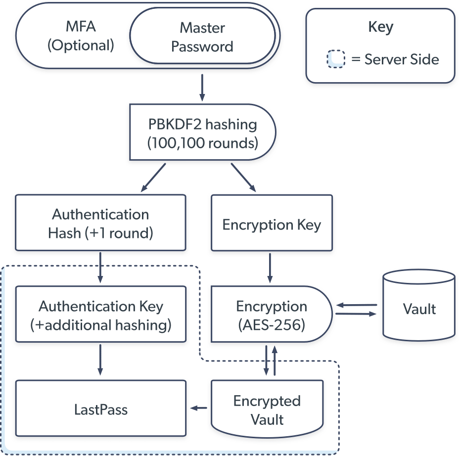

# Exploring encryption in python

## Design and Implementation notes

### File system layout

#### pp_locker (the library/server app API)
- [installed dir]
  - `.pp_locker.conf`: application configuration
  - `system`: directory with initial items available to all users (e.g. tags, templates)
  - `users`: directory with users' lockers
    - (user1): directory, name will be one-way hash of user-assigned name

#### pp_cli (the command-line client)
[installed dir]
  - `.pp_cli.conf`: application configuration
  - `users`: directory with users' data
    - (user1): directory, name will be one-way hash of user-assigned name
  
`pp_cli` offers the ability to allow "client-side caching" of plain-text data.
One of the initial requirements [1] of the project was to support a CLI workflow like:
> pp_cli edit "capital-one"

[1] https://gist.github.com/criswell/c75baee3f812872fe02f03ecd4c92962

#### Guiding design principle - strict security

There are choices I'm making that some people might consider "overkill".
Those people would be wrong.
For example, I've chosen to encrypt entity names within each locker
using the key and salt for that locker, rather than expose the
names chosen by the user.

- The locker password is never stored.

A hash of the password is encrypted and stored.
Authentication is done by hashing and encrypting the submitted
password and comparing to the value stored in the locker file.

- Filenames for Lockers are hashed

Just like the password, the name can only be confirmed, not derived.
A salt of zero is used, to reduce complication.
This should be sufficient, as it's only to obscure names.

- Filenames for Items are encrypted

The salt (and of course encryption key) from the Locker are used.
Just hashing these names won't do, because the user does require
use cases like "list Secrets", so decrypting is required.

UPDATE:
In order to further reduce any ability to intuit from locker data,
rather than storing item types in distinct dirs, I'm storing
all the encrypted item files in the locker directory.

There are several concerns that would have been met by having
separate directories and I've had to resolve them in other ways.

Q: How do I avoid name collisions between different item types?
A: By including the item type in the file name.

def get_file_name(item_name, item_type):
    foo = encrypt(item_name)
    bar = encrypt(item_type)
    return encrypt(f"{item_type}:{item_name}") 

- client vs. server

The command-line client is being developed first, hand-in-hand with the model.
However, I am trying to keep client concerns separate from model concerns.
For example, if the model were fronted by a Flask app, the idea of
launching an editor for an item during a workflow would be nonsensical.

Additionally, at this moment, I have built into the model the concept
of storing both the plaintext and encrypted versions of an item.
I am removing this, and possibly adding the ability to store plaintext
versions in the CLI, so that in the scenario where the model is
deployed behind a web app, it is baked in that there is no functionality
exposed that allows persisting the users' private data on the server.

First basic idea:
Encrypt user credentials securely enough to use a private github repo as a shared store between devices.

Planning to follow the LastPass model, nice diagram in the link below.

[Source](https://www.lastpass.com/security/what-if-lastpass-gets-hacked)

Access to the vault is controlled via master password.

Contents of the vault are encrypted using AES-256.

### Discussion

In this implementation, all of the components will execute locally, without communicating over network.

What a vault looks like is worth some discussion.

The short-term desired outcome is to have file(s) that can be pushed to internet-accessible storage (e.g. a github repo) then accessed from other devices, allowing the user to discover and use the authentication credentials stored in the file(s).

How do new credentials get put into the vault?
One could have a file director which only contains plaintext username:password pairs and hash/encrypt them all together. That's not very secure.

Another option would be to set/get items only by CLI, storing encrypted only.
One challenge that adds is that it inhibits storing larger or more complex (e.g. structured) content. This could be addressed later by supporting a command-line switch that says "encrypt and store this whole file".

Let's start real simple: get and set a username/password pair.

- https://www.quickprogrammingtips.com/python/aes-256-encryption-and-decryption-in-python.html 
- https://stackoverflow.com/questions/15375171/pycrypto-install-fatal-error-gmp-h-file-not-found

Consider some use of environment variables to expire master authentication.
Like PP_MAX_VALID_TIME that gets checked with every operation; need somehow
to guard against someone manually extending it to infinity. Maybe cryptic hash
of that value to PP_LOCK_VALUE to assure it hasn't been set outside the app.

Using PBKDF2 for hashing the master password for now; It's good enough for LastPass, and the native hash library supports it.
May need to move from PBKDF2 to Argon2id eventually:
- https://medium.com/analytics-vidhya/password-hashing-pbkdf2-scrypt-bcrypt-and-argon2-e25aaf41598e
- https://pypi.org/project/argonautica/

Eventually, memory contents could be a concern.
- https://www.sjoerdlangkemper.nl/2016/06/09/clearing-memory-in-python/

#### Apparent LastPass implementation

There are browser plugins, and local full clients.
All Chrome plugins use the Chrome storage API, so it's hard to inspect their storage, so I'm not certain whether they have all the same data as the full clients do, but it's a reasonable supposition that they do.

~/Library/Application Support/Google/Chrome/Default/databases/
chrome-extension_hdokie.../49

I can start the Mac client and still be logged in and have full permissions from a previous session.

Neither the client nor the server know the master password (MP). Rather, upon creation of the MP by the user, MP is hashed using PBKDF2, and that hash is stored on the server (read: at any location where a vault copy is stored).

### Use cases

#### Vault

- CRUD vault
- CRUD master password
  - With a new master password, hash with PBKDF2, store the hash only
- View/Browse vault

#### Vault Entry

- CRUD vault entry (like credentials to some website)
  - With a new vault entry, encrypt the secure portion (password) using AES-256 and the master password hash as the encryption key
- View vault entry

#### Scenario narratives
- I am creating an account on a website, and need to store the new password.
- I want to log into my bank website, and need to retrieve the stored password.
- I forgot my username for a website, much less the password.
- I want use my vault on a new device.
- I want to lock a vault on my device so any interaction requires the master password.

### Glossary

- AES: Advanced Encryption Standard (Rijndael)
- cipher: an algorithm for encrypting data
- ciphertext: the encrypted data from putting plaintext through a cipher
- encryption: altering data to make it secret. A two-way process
- hashing: creating a fixed-length data from any data. A one-way process
- HMAC: hash-based message authentication code
- MAC: message authentication code (think MD5 to verify package authenticity)
- MFA: Multi-factor Authentication
- PBKDF2: Password-Based Key Derivation Function 2, takes a passphrase, a salt (64 bit standard), and a hashing function and iterates over the message thousands of times to make the operation prohibitively computationally expensive to build rainbow tables or crack. See python _hashlib_ library.
- plaintext: the data a user wants to encrypt
- Salt: a random value appended to a password before hashing to increase the difficulty of cracking (and eliminate collisions if the same password is used twice). NIST recommends 128 bit salt. Use the python _secrets_ library for this.

 

### References

- LastPass model
  - https://www.lastpass.com/security/what-if-lastpass-gets-hacked

- Good python AES-256 details:
  - https://www.quickprogrammingtips.com/python/aes-256-encryption-and-decryption-in-python.html

- Stack Overflow with numerous useful answers:
  - https://stackoverflow.com/questions/12524994/encrypt-decrypt-using-pycrypto-aes-256
  
- Symmetric vs. Asymmetric:
  - https://answersdrive.com/which-is-more-secure-symmetric-or-asymmetric-encryption-3160405
  
- Elliptical Curve Cryptography (ECC)
  - https://qvault.io/2019/12/31/very-basic-intro-to-elliptic-curve-cryptography
  
- MFA auth package
  - https://pypi.org/project/authenticator/
